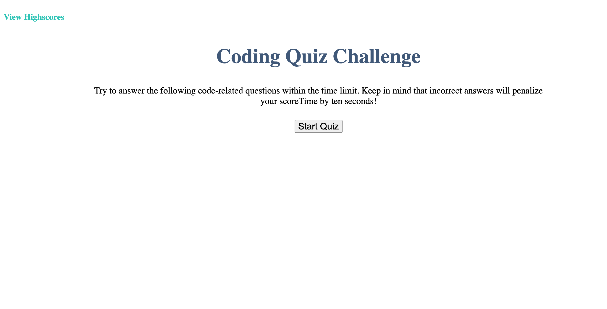

# Code-Quiz-Challenge

## [Code Quiz](https://josiemald.github.io/coding-quiz/)

## [Repository](https://github.com/JosieMald/coding-quiz)



### Project:
```
AS A coding boot camp student create a timed quiz on JavaScript fundamentals that stores high scores
so that I can gauge my progress compared to my peers.
```

### Description
```
A quiz created to help users time your progress as you answer questions. When questions are wrong the user is deducted 10 seconds from there score. The user can compare from there previous scores by looking at the high scores page which displays there initials and score time.
```

<!-- This project was created using DOM manipulation and local storage. -->